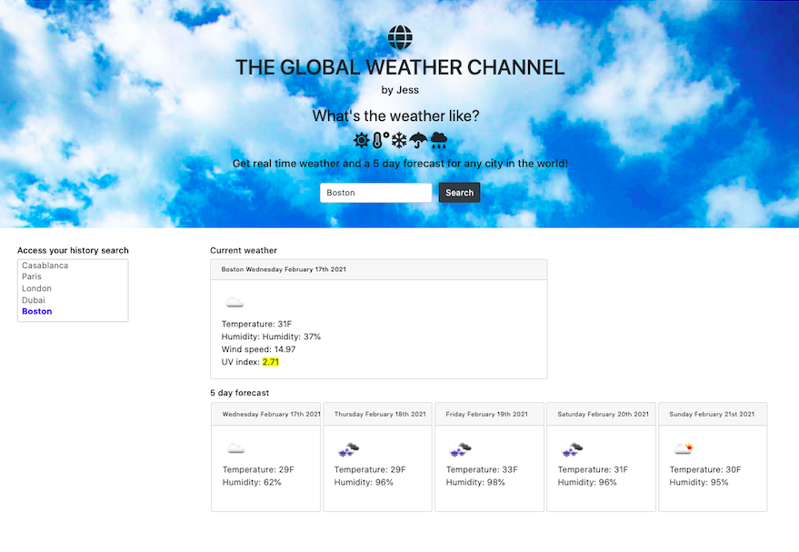
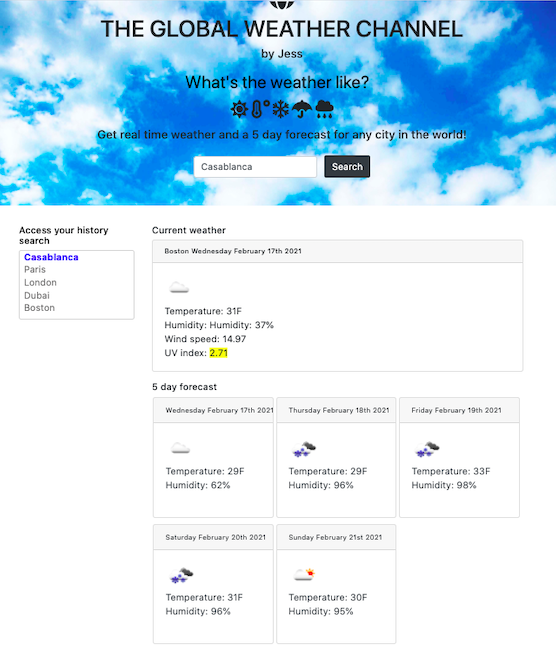
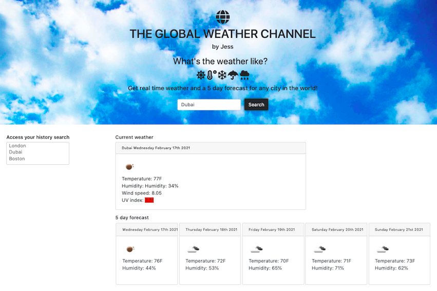

## The Weather Dashboard

### What I did

``
Using a 3rd party API - OpenWeather API - the user is able to access weather data for any city they search. They will then have access tu current weather - including temperature, uv index, humidity, windspeed and an icon representing the weather- and forecast for the next 5 days. Thanks to localstorage, the past cities searched are stored and appear in a list of past citites searched, available for the user to click again and access all information. When the page reloads, the last search is loaded to the input.
Bootstrap was used to style this project.

``

### Project screenshots

## Project submissions

- The URL of the deployed application:
  https://jessicaperez1.github.io/Weather-Dashboard/

- The URLs of the GitHub repositories:
  https://github.com/JessicaPerez1/Weather-Dashboard.git
